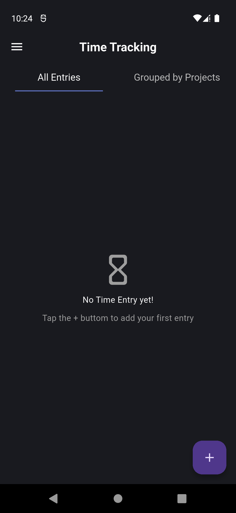
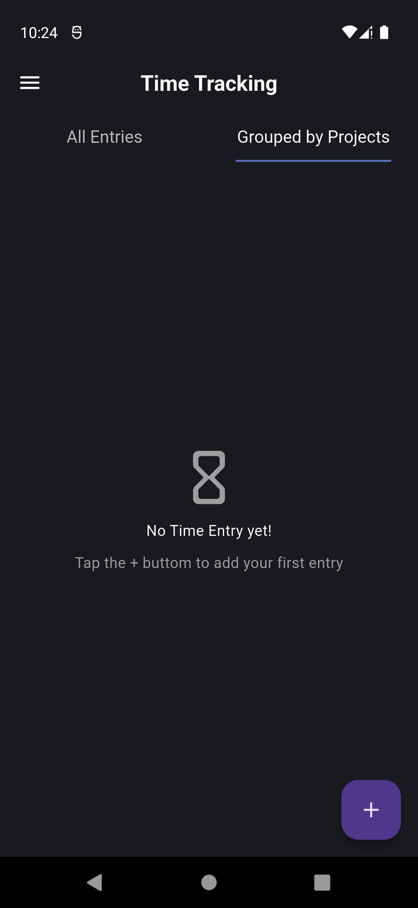
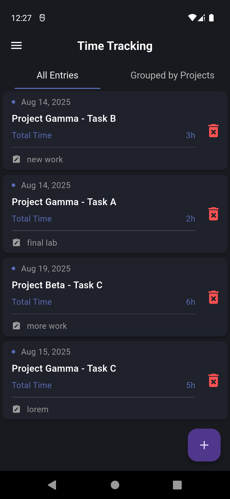
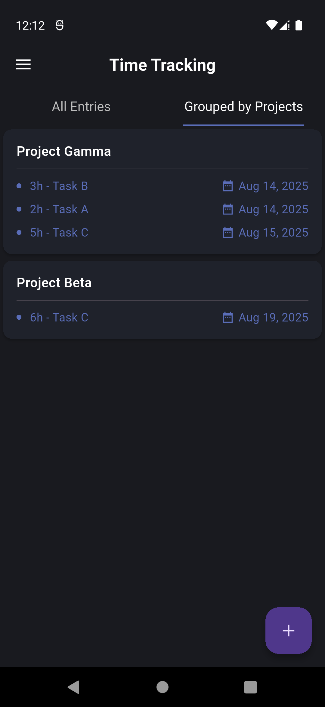

# Time Tracking

We are deprecating mobile apps as [discussed here](https://discuss.erpnext.com/t/deprecating-erpnext-mobile-apps/84121). 

A simple and elegant time tracking application built with Flutter. It allows users to efficiently log, manage, and track time spent on various projects and tasks, offering a clean interface for organizing work and enhancing productivity.


## Project Background

This application was created as a final project for a professional training course in **Flutter Development**, provided by **IBM**. The course focused on building robust, scalable applications using best practices, including:
* Effective state management with `provider`.
* Building reusable and maintainable widgets.
* Local data persistence with `shared_preferences`.

This project serves as a practical demonstration of the skills and knowledge acquired during the course.


## Screenshots

### Interactive Home Page 
The main interface  When no data is available, the user is shown an empty state message with an option to add a new entry using the floating action button at the bottom.

<kbd></kbd>
<kbd></kbd>

### Interactive Home Page Entries
Shows the main screen with several time entries listed.


<kbd></kbd>
<kbd></kbd>


## Features
- **Intuitive UI**: A clean and user-friendly interface for seamless time logging.

- **Project & Task Management**: Easily add, edit, and delete projects and tasks.

- **Time Entries**: Log time entries with details like project, task, date, and notes.

- **Data Persistence**: All data is stored locally using shared_preferences for offline access.

- **Reusable Components**: The codebase is built with reusable widgets and a Provider-based architecture for maintainability and scalability.


## Technical Stack

- **Framework**: Flutter
- **State Management**: Provider
- **Local Storage**: `shared_preferences`
- **Dependencies**: `jiffy`, `uuid`, `collection`, 


## Getting Started

Follow these instructions to get a copy of the project up and running on your local machine.


### Prerequisites

- [Flutter SDK](https://flutter.dev/docs/get-started/install) installed.
- An IDE (VS Code or Android Studio).


## Installation Steps

### Clone the repository

- Open your terminal or command prompt
- Navigate to the directory where you want to save the project
- Use the git clone command followed by the repository URL

```sh
git clone https://github.com/m-alshabibi/Time_Tracker.git
```

### Install dependencies

- Navigate to the project's directory

```sh
cd <repository-name>
```

- Run the following command to install the required packages

```sh
flutter pub get
```

### Run the Project

- Use the following command to build and run the project

```sh
flutter run
```